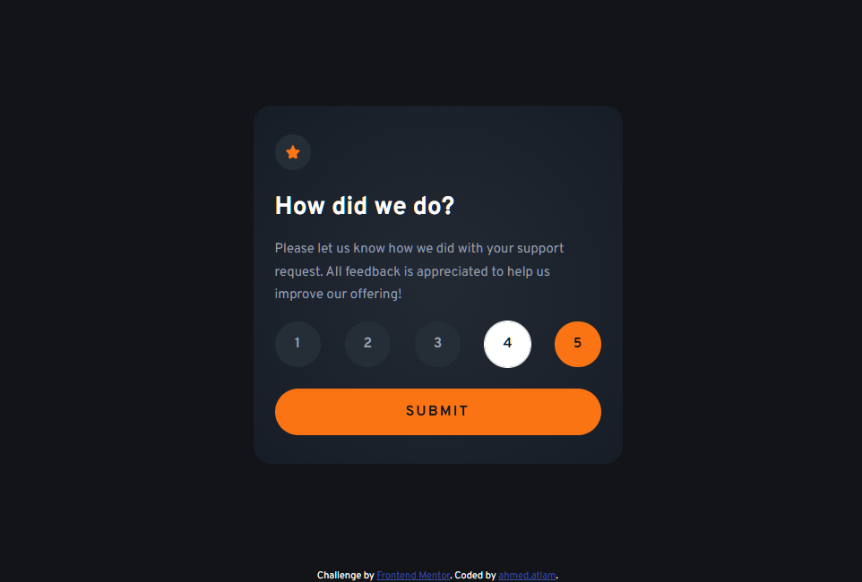

# Frontend Mentor - Interactive rating component solution

This is a solution to the [Interactive rating component challenge on Frontend Mentor](https://www.frontendmentor.io/challenges/interactive-rating-component-koxpeBUmI).

### The challenge

Users should be able to:

- View the optimal layout for the app depending on their device's screen size
- See hover states for all interactive elements on the page
- Select and submit a number rating
- See the "Thank you" card state after submitting a rating

### Screenshot

### Links

- Solution URL: [Here Is My solution URL](https://github.com/ahmedattlam10/Interactive-rating-component)
- Live Site URL: [Here Is My live site URL](https://ahmedattlam10.github.io/Interactive-rating-component/)

### Built with

- Semantic HTML5 markup
- CSS custom properties
- Flexbox
- Mobile-first workflow
- Responsive Design
- Vanilla JavaScript

## Author

- Website - [Github-Profile](https://github.com/ahmedattlam10)
- Frontend Mentor - [FM-profile](https://www.frontendmentor.io/profile/ahmedattlam10)
